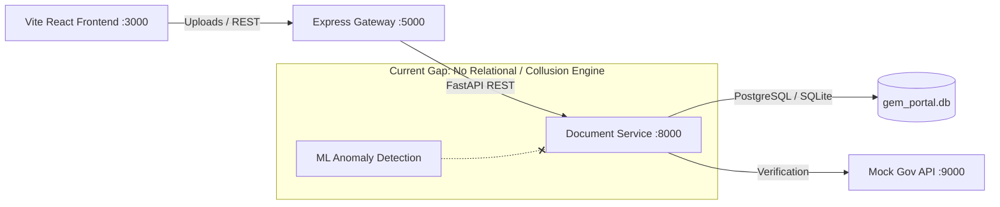
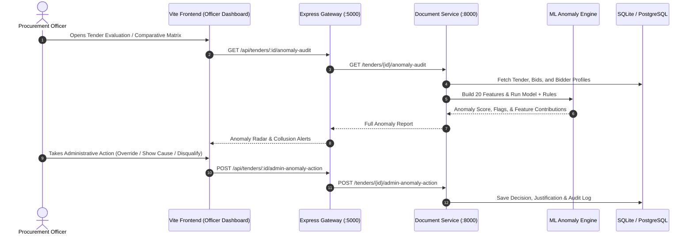

# 🛡️ Implementation Plan: ML Tender Anomaly & Anti-Collusion Integration into GeM Portal

This document outlines the end-to-end strategy to integrate the **Isolation Forest & Rule-Based Tender Anomaly Detection Engine** (`MOCK-API-main`) into the **GeM Portal Integration Platform** (`GEM_PORTAL_INTEGRATION`), with specific focus on **Admin (Procurement Officer) Allowance, Oversight, and Governance**.

---

## 1. Executive Summary & Objective

- **Source Project (`MOCK-API-main`)**: A production-ready unsupervised Machine Learning pipeline (`train_isolation_forest.py`) powered by `scikit-learn` Isolation Forest and deterministic high-certainty rules. It evaluates 20 structural, behavioral, and relational features to detect **bid rigging, cartel behavior, price clustering, shell bidder networks, and submission anomalies** with **100% recall and 77.8% precision** on test anomaly cases.
- **Target Project (`GEM_PORTAL_INTEGRATION`)**: An enterprise public procurement platform comprising a React 19 / Vite frontend, an Express API Gateway, and a FastAPI Document Processing service (`document-service`) managing tenders, bidders, and a 4-stage compliance verification pipeline.
- **The Core Problem**: The target platform currently assesses only *individual document compliance* (Stage 1 Baseline, Stage 2 Technical, Stage 3 Exemptions). **It has zero relational intelligence or anti-collusion safeguards.** The Officer Dashboard blindly recommends the lowest price (L1) bidder even if the bids are submitted by linked sister firms with shared directors, identical phone numbers, or artificial price collars.
- **Goal**: Integrate the anomaly detection model into `GEM_PORTAL_INTEGRATION` to empower the Procurement Officer/Admin with automated collusion radar, risk scoring, explainable anomaly breakdowns, and formal administrative override allowances.

---

## 2. In-Depth Audit of the Target Project (`GEM_PORTAL_INTEGRATION`)

### 2.1 Current System Topology

### 2.2 Audit of Current Admin / Officer Allowances
An inspection of `src/components/officer/OfficerDashboard.tsx`, `document-service/models.py`, and `server.ts` reveals the following current state of admin authority:

| Area | Current Allowance / Implementation | Limitation / Vulnerability |
|---|---|---|
| **Bidder Evaluation** | Inspects individual bidder certificates (PAN, GSTIN, Udyam, Debarment). | Evaluates each bidder in complete isolation. Cannot detect if Bidder A and Bidder B share directors or addresses. |
| **Commercial Ranking** | Sorts submissions by `commercialQuote` in `ComparativeEvaluationModal` (`idx === 0 && !isDebarred && sub.status !== 'Disqualified'`). | **Vulnerable to Bid Rigging**: A cartel submitting dummy high bids and one coordinated winning bid will win L1 automatically. |
| **Disqualification Powers** | Officer can toggle status: `Verified`, `Under Review`, `Disqualified`. | Disqualification reasons are limited to baseline document defects (e.g. debarment or invalid GSTIN). No statutory flag for **GFR Rule 144(xi)** / Competition Act collusion. |
| **Flag System** | Simple text array `flags: string[]` stored on `BidSubmissionModel`. | Only receives basic OCR mismatch strings; no structured anomaly schema, severity scores, or confidence levels. |
| **Tender-Level Oversight** | Officer can publish tenders and close bidding. | Cannot view cross-tender historical patterns (e.g. repeated single-bidder patterns for specific buyer departments). |

---

## 3. ML Model Architecture & Assets (`MOCK-API-main`)

### 3.1 Model Artifacts Available
- Model binary: `model_output/isolation_forest_tender_anomaly.joblib` containing:
  - `model`: Fitted `IsolationForest` (500 estimators, contamination=0.03).
  - `scaler`: `RobustScaler` fitted on 355 clean historical tenders.
  - `threshold`: `0.54587` calibrated for optimal F1 on validation splits.
  - `features`: Exact 20-feature input schema.
- Benchmark data: `model_output/validation_report.json` and `model_output/test_predictions.csv`.

### 3.2 Feature Set (20 Dimension Vectors)
The model synthesizes tender-level and bidder-relational indicators:
1. **Pricing & Spread Dynamics**: `price_to_estimate_median`, `price_to_estimate_std`, `price_to_estimate_range`, `winner_price_to_estimate`, `winner_margin`.
2. **Relational / Cartel Indicators**: `linked_bidder_pairs` (shared address, phone, or directors), `near_price_pair_fraction` (clustering within 0.1% margin).
3. **Temporal & Bidding Behavior**: `submission_span_minutes`, `last_day_submission_fraction`, `bid_count`, `single_bidder`, `window_days`.
4. **Firm Maturity & Exposure**: `min_bidder_age_days`, `winner_age_days`, `new_firm_fraction`, `log_value_per_min_age`, `log_estimated_value`.
5. **Buyer History**: `buyer_item_prior_count`, `buyer_prior_single_bid_rate`.

### 3.3 Explainable High-Certainty Safeguards
In addition to the raw tree score, `high_certainty_rules()` flags:
- Any tender where `linked_bidder_pairs > 0` (direct collusion).
- Any tender where `near_price_pair_fraction > 0` and price standard deviation `< 0.002` (price fixing).
- Any high-value tender (`log_estimated_value > 16`, ~₹1 Crore+) with shell firms (`min_bidder_age_days < 365`).

---

## 4. Proposed Integration Architecture

### 4.1 Recommended Service Topology
Instead of creating a 5th standalone service, the ML engine should be mounted **directly inside `document-service` (Port 8000)** because:
1. `document-service` already maintains database connections (`CompanyModel`, `TenderModel`, `BidSubmissionModel`).
2. It already operates as a Python FastAPI service with NumPy and scikit-learn compatible dependencies.
3. It minimizes network overhead and centralizes all AI evaluation logic (RAG + Docling + ML Anomaly Engine).

---

## 5. Admin Allowance & Governance Specifications

To provide the Admin/Procurement Officer with the necessary legal and operational allowance, the integration will introduce 4 specific governance modules:

### 5.1 Admin Allowance Matrix

| Officer Action | Trigger Condition | System Allowance & Safeguards |
|---|---|---|
| **Halt Tender Evaluation** | `predicted_anomaly == 1` or `anomaly_score >= threshold` | Officer can place the tender in `Under Integrity Review` status, freezing automated L1 contract generation. |
| **Issue Show-Cause Notice** | Identical prices (`near_price_pair_fraction > 0`) or linked directors | Generates a statutory GeM notice requiring bidders to explain price similarities or relationship under GFR 2017. |
| **Administrative Override** | Officer verifies legitimate subcontracting or consortium arrangement | Officer can formally override an anomaly alert by entering a mandatory **Justification Memo** and **Officer Employee ID**, recorded in an immutable audit log. |
| **Cartel Disqualification** | Confirmed collusion or linked shell firms | Allows the Officer to disqualify the entire cartel ring in a single click, automatically recalculating the compliant L1 bidder. |

### 5.2 Officer Dashboard UI Enhancements
1. **Collusion & Cartel Alert Banner**:
   - Placed at the top of the `ComparativeEvaluationModal`.
   - Displays risk tier: 🟢 **Low Risk** | 🟡 **Suspicious Patterns (Review)** | 🔴 **High Collusion Risk (Halt Award)**.
2. **Linked Bidder Network Graph / Cluster View**:
   - Highlights common corporate connections (shared directors, identical registered addresses, or shared phone contacts).
3. **Price Cluster Inspector**:
   - Visualizes quoted prices across bidders against estimated budget to reveal artificial price floors.
4. **Admin Override Modal**:
   - Explicit dialog capturing administrative authorization before any flagged tender can proceed to contract award.

---

## 6. Implementation Roadmap & Milestones

### Phase 1: Engine & Asset Relocation (Day 1)
- Copy `model_output/isolation_forest_tender_anomaly.joblib` into `document-service/ml_models/`.
- Ensure `scikit-learn`, `joblib`, and `pandas` are added to `document-service/requirements.txt`.
- Create `document-service/anomaly_detector.py` providing:
  - Feature extraction logic from `TenderModel`, `BidSubmissionModel`, and `CompanyModel`.
  - Batch and single-tender inference with the joblib model.
  - Explainable rule evaluation (`high_certainty_rules`).

### Phase 2: Backend API Endpoints (Day 2)
- Add endpoints to `document-service/main.py`:
  - `GET /tenders/{tender_id}/anomaly-assessment`: Returns anomaly scores, feature contributions, and flagged bidder pairs.
  - `POST /tenders/{tender_id}/anomaly-override`: Records officer override with justification.
- Extend Express Gateway `server.ts` to proxy these endpoints and integrate with tender status flows.

### Phase 3: Database Schema & Audit Persistence (Day 2)
- Update `TenderModel` in `document-service/models.py`:
  - `anomaly_score`: Float
  - `is_anomaly`: Boolean
  - `anomaly_flags`: JSON
  - `anomaly_status`: String (`CLEARED`, `FLAGGED`, `OVERRIDDEN`, `REJECTED`)
  - `admin_override_notes`: Text
  - `admin_action_timestamp`: DateTime

### Phase 4: Frontend Officer Dashboard Integration (Day 3)
- Update `src/types/index.ts` to include anomaly and collusion types.
- Modify `ComparativeEvaluationModal` in `OfficerDashboard.tsx`:
  - Display Anomaly Badge beside each bidder.
  - Add Cartel Alert bar above the L1 recommendation.
  - Disable the "Award Tender" button if unaddressed high-certainty anomalies exist.
  - Add "Investigate Collusion" and "Administrative Override" action buttons.

### Phase 5: Testing, Validation & End-to-End Verification (Day 4)
- Run synthetic test cases from `test_predictions.csv` through the API.
- Verify that real-time tender creation and bid submission properly populate feature matrices.
- Validate that Admin override requires comments and correctly maintains the audit trail.

---

## 7. Concrete Suggestions & Immediate Next Steps for the Admin

1. **Adopt Dual-Tier Alerting (Strict vs. Exploratory)**:
   - Do not automatically disqualify on unsupervised score alone. Use `predicted_anomaly` (strict rule + score) to **halt**, and `isolation_forest_flag` as an **exploratory warning icon** for officer review.
2. **Prevent Cartel L1 Awards**:
   - In `ComparativeEvaluationModal`, update the sorting and L1 logic so that bidders belonging to a flagged cartel group cannot be awarded L1 until cleared by the Procurement Officer.
3. **Incorporate Cross-Entity Matching**:
   - Ensure the bidder registration form captures PAN, director names, phone numbers, and registered addresses so the feature extraction engine can compute `linked_bidder_pairs` dynamically.
4. **Exportable Vigilance Report**:
   - Provide the Admin with a one-click "Export Anti-Collusion Dossier (PDF/JSON)" to submit to the Chief Vigilance Officer (CVO) or Competition Commission of India (CCI) when severe bid rigging is identified.
